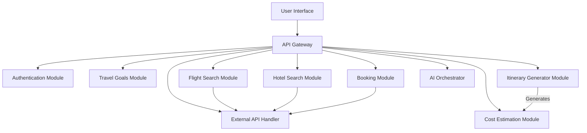
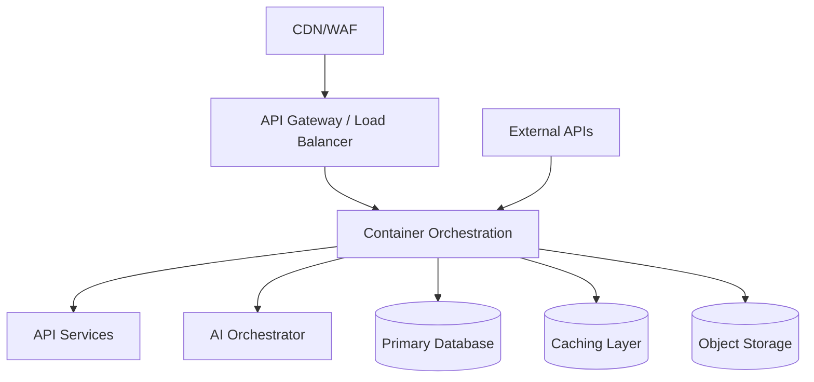

## 1. Document Overview

### Project Name
AI Travel Planning Assistant

### Version
1.0

### Author
Architecture Assembler

### Date
November 16, 2023

### Purpose
This document outlines the architecture for an AI-driven travel planning assistant designed to plan trips end-to-end, including goal understanding, flight and hotel searches, itinerary generation, cost estimation, and user refinement of plans.

### Scope
Define what is included and excluded in this architecture.

Included:
- application architecture
- infrastructure architecture
- data architecture
- security architecture
- technology architecture

Excluded:
- detailed sprint plan
- detailed test cases
- operational runbooks

---

## 2. System Context

### Business Context
The AI Travel Planning Assistant addresses the demand for seamless and personalized travel booking experiences, providing users with end-to-end support for trip planning through AI technologies.

### Architecture Goals
- Seamless user experience in planning end-to-end trips.
- Robust integration with third-party services for flight and hotel bookings.
- Scalable design to handle increasing user traffic.
- Secure and private handling of user data.

### Architecture Drivers
- User demand for personalized and automated travel solutions.
- Integration with various third-party APIs.
- Scalability and maintainability requirements.
- Security and compliance with data privacy standards.

---

## 3. Solution Overview

### High-Level Architecture Summary
The architecture adopts a modular design with clearly defined modules for different functionalities such as user interface, API gateway, travel modules, and AI orchestration.

### Recommended Architecture Style
- modular monolith (default choice for MVP)

### Architecture Rationale
A modular monolith allows for coherent management and development processes while supporting future scalability by maintaining clear module boundaries.

### Design Alternatives and Trade-offs
A simpler approach could be a completely integrated monolith; however, this risks tight coupling making future modifications cumbersome. Choosing a modular approach balances between immediate simplicity and future extensibility.

---

## 4. Application Architecture

### Functional Modules / Components
- **User Interface (UI):** Frontend interface for user interaction.
- **API Gateway:** Serves as the entry point for all client requests.
- **Travel Goals Module:** Handles input and understanding of user travel goals.
- **Flight Search Module:** Communicates with third-party flight APIs.
- **Hotel Search Module:** Communicates with third-party hotel APIs.
- **Itinerary Generator Module:** Compiles travel itineraries based on user selections.
- **Cost Estimation Module:** Estimates and presents the total cost of a proposed trip.
- **Booking Module:** Manages bookings for flights and hotels.
- **Authentication Module:** Manages user authentication.
- **AI Orchestrator:** Coordinates AI-driven recommendations and decisions.
- **External API Handler:** Manages interaction with third-party services.

### Responsibilities of Each Module

#### Authentication Module
- User registration
- Login
- Token issuance
- Password reset

#### Travel Goals Module
- Capture user travel preferences
- Provide personalized travel suggestions

#### Flight Search Module
- Search available flights based on user input
- Show options sorted by price, duration, and departure time

#### Hotel Search Module
- Search hotel accommodations
- Filter results by price, amenities, and location

#### Itinerary Generator Module
- Generate travel itineraries
- Export itineraries in multiple formats

#### Cost Estimation Module
- Calculate total trip costs
- Provide cost breakdowns

#### Booking Module
- Handle confirmations and cancellations
- Interface with third-party booking systems

### Application Interaction Flow
1. User provides travel preferences through the UI.
2. User information is sent to the API Gateway.
3. Travel Goals Module processes preferences and provides recommendations.
4. User selects flights and hotels through the UI.
5. Selections are processed by the Flight Search and Hotel Search Modules.
6. Itinerary Generator compiles a plan and the Cost Estimation Module calculates expenses.
7. User confirms selections, invoking the Booking Module to finalize arrangements.

### Component Diagram


### Key Business Flows

#### Flow 1: User Plans Trip
1. User inputs travel preferences.
2. API processes inputs and provides flight and hotel options.
3. User chooses options, which are priced and integrated into a draft itinerary.
4. Itinerary is finalized, including cost estimation.
5. Booking Module confirms all reservations.

### Logical Architecture
Logical separation is ensured between frontend, services, and external APIs, promoting scalability and maintainability.

### Architecture Assertions
- Use of modular design to facilitate future extension.
- Clear API contracts ensure consistent integration with external services.

---

## 5. AI / ML Framework and Stack (required for AI-centric projects)

### LLM Provider and API
- Primary LLM provider and model: OpenAI GPT-4
- Fallback or secondary model (if any): None
- API client / SDK: OpenAI Python Client

### Orchestration and Application Framework
- Framework for LLM orchestration, prompts, and tool use: Langchain
- Version or minimum version: 0.1.0
- How agents/chains/tools are defined: YAML configuration for definition and workflows

### Embeddings and Vector Store (if used)
- Embedding model: OpenAI's Ada
- Vector database: Pinecone
- Use case: Storing and retrieving semantic search vectors for personalized recommendations

### Tool Integration
- How external APIs are exposed to the LLM: Wrapped in callable classes
- List specific tool names and which API or library they call: Flask for API, Requests for HTTP

### Prompt and Safety
- Where prompts are stored: In a secure database within a dedicated orchestration module
- Safety or content filtering: Implemented through OpenAI's moderation tools
- Rate limiting and cost controls for LLM calls: Strict call quotas and budgeting allocations within infrastructure tools

### AI Stack Rationale
- The choice of OpenAI GPT-4 is motivated by its comprehensive language understanding abilities.
- Langchain provides flexibility in orchestrating complex AI tasks.
- Pinecone selected for its high-efficiency vector storage and search capabilities.

---

## 6. Technology Architecture

### Recommended Technology Stack

#### Frontend
- framework: React
- language: JavaScript/TypeScript
- UI framework: Material-UI
- state management: Redux
- testing framework: Jest

#### Backend
- framework: Flask (Python)
- language: Python 3.9
- API style: REST
- ORM / data access: SQLAlchemy
- testing framework: Pytest

#### Database
- database engine: PostgreSQL
- migration tool: Alembic
- caching layer (if any): Redis

#### Infrastructure / Platform
- cloud provider: AWS
- container / runtime: Docker with Kubernetes orchestration
- CI/CD tool: Jenkins for automated deployments
- secrets manager: AWS Secrets Manager
- monitoring tools: Prometheus and Grafana

### Technology Selection Rationale
React and Material-UI chosen for rich, interactive, and responsive interfaces. Flask and SQLAlchemy deploy strong integration with Python's ecosystem for scalable backend applications. AWS offers scalable and reliable infrastructure, making it the preferred cloud provider.

### Technology Constraints
- Must work within AWS's ecosystem to leverage existing organizational investments.

---

## 7. Data Architecture

### Core Data Entities
1. User
2. TravelGoal
3. Flight
4. Hotel
5. Itinerary
6. Activity
7. Booking
8. Payment
9. Review
10. Location

#### Top Entities (fields)
| Entity      | Key fields (5–10)                                   | Primary key | Notes                                  |
|-------------|-----------------------------------------------------|-------------|----------------------------------------|
| User        | user_id (uuid), email (string, unique), name (string), created_at (timestamp), updated_at (timestamp) | user_id     | Represents an application user.        |
| TravelGoal  | goal_id (uuid), user_id (uuid, FK), destination (string), start_date (date), end_date (date), preferences (json), created_at (timestamp), updated_at (timestamp) | goal_id     | User's trip preferences and objectives. |
| Flight      | flight_id (uuid), travel_goal_id (uuid, FK), airline (string), departure_time (timestamp), arrival_time (timestamp), price (decimal), booking_status (enum), created_at (timestamp) | flight_id   | Offers flight details per goal.        |
| Hotel       | hotel_id (uuid), travel_goal_id (uuid, FK), name (string), check_in (date), check_out (date), price_per_night (decimal), booking_status (enum), created_at (timestamp) | hotel_id    | Manages hotel preferences and bookings.|
| Itinerary   | itinerary_id (uuid), travel_goal_id (uuid, FK), activities (json), total_cost (decimal), created_at (timestamp), exported_format (string) | itinerary_id| Aggregates travel plans into itineraries.|

### Entity Responsibilities

#### User
Represents a registered application user with personal and account details.

#### TravelGoal
Captures the user's travel goals including preferences, destinations, and objectives.

#### Flight
Details the flight options tied to a user's travel goal, including booking information.

#### Hotel
Manages hotel preferences, availability, and booking linked to a travel goal.

#### Itinerary
Compiles the travel plans into a structured form, linking activities and bookings.

### Entity Relationships
- User 1:N TravelGoal
- TravelGoal 1:N Flight
- TravelGoal 1:N Hotel
- TravelGoal 1:N Itinerary
- Itinerary 1:N Activity
- TravelGoal 1:N Booking
- TravelGoal 1:N Payment
- Hotel 1:N Review

### Data Ownership

- User data handled by Authentication Module.
- TravelGoal, Booking, and Itinerary data handled by Travel Planning Module.
- Flight and Hotel booking details handled by Booking Module.
- Reviews managed by User Feedback Module.

### Data Lifecycle

- **Create**: User registers, sets TravelGoal, and adds bookings which populate related data.
- **Update**: Users modify travel details; idempotent updates for booking statuses.
- **Archive/Delete**: Soft delete for records with `deleted_at`. Retain for audit in logs.

### Data Storage Strategy

- **Transactional Store(s)**: Primary relational database for operational data.
- **Object/File Store(s)**: N/A currently.
- **Cache(s)**: In-memory cache for session data and frequent lookups.

### Data Quality / Validation Rules

- Ensure email uniqueness via constraints.
- Enforce foreign keys for referential integrity.
- Validate format and range for dates and numeric fields.

### Data Retention and Archival

- **Retention Policy**: Retain active records for the duration of user engagement, archive inactive records post engagement.
- **Archival/Deletion Policy**: Archive data flagged with `deleted_at` after 365 days; delete after 730 days.

---

## 8. API and Integration Architecture

### API Design Principles
- **Base Path:** `/api/v1`
- **Versioning:** URL-based with explicit deprecation policy
- **Error Model:** Standard JSON format for errors
- **Idempotency:** Required for all POST requests affecting state with an `Idempotency-Key`

### Internal APIs / Service Interfaces

#### Endpoint Catalog
| Domain           | Endpoint                      | Method | Auth | Request (Summary)                            | Response (Summary)                         | Error Shape  |
|------------------|-------------------------------|--------|------|---------------------------------------------|-------------------------------------------|--------------|
| Authentication   | `/users/login`                | POST   | No   | `{ "email": "string", "password": "string"}`| `{ "token": "string" }`                   | Error Schema |
| Travel Goals     | `/travel-goals`               | POST   | Yes  | `{ "destination": "string", "dates": [...], "preferences": {...} }` | `{ "recommendations": [...] }` | Error Schema |
| Flight Search    | `/flights`                    | GET    | Yes  | `?destination=string&from_date=string&to_date=string` | `{ "flights": [...] }`                  | Error Schema |
| Hotel Search     | `/hotels`                     | GET    | Yes  | `?destination=string&check_in=string&check_out=string` | `{ "hotels": [...] }`                    | Error Schema |
| Itinerary        | `/itineraries`                | POST   | Yes  | `{ "flight_id": "number", "hotel_id": "number" }` | `{ "itinerary": {...} }`               | Error Schema |

#### Representative JSON (3+ endpoints)

- **Login Request/Response/Error**
  - Request:
    ```json
    {
      "email": "user@example.com",
      "password": "securePassword123"
    }
    ```
  - Response:
    ```json
    {
      "token": "eyJhbGciOiJIUzI1NiIsInR..."
    }
    ```
  - Error:
    ```json
    {
      "error": {
        "code": "401",
        "message": "Unauthorized access",
        "correlationId": "abc123"
      }
    }
    ```

- **Flight Search Request/Response/Error**
  - Request:
    ```http
    GET /flights?destination=Bali&from_date=2023-12-01&to_date=2023-12-10
    ```
  - Response:
    ```json
    {
      "flights": [
        {"flight_id": "123", "price": 500, "departure": "10:00", "duration": "6h"}
      ]
    }
    ```
  - Error:
    ```json
    {
      "error": {
        "code": "404",
        "message": "No flights found",
        "correlationId": "def456"
      }
    }
    ```

- **Hotel Search Request/Response/Error**
  - Request:
    ```http
    GET /hotels?destination=Paris&check_in=2023-11-20&check_out=2023-11-25
    ```
  - Response:
    ```json
    {
      "hotels": [
        {"hotel_id": "456", "name": "Hotel Luxe", "price": 150, "rating": 4.6}
      ]
    }
    ```
  - Error:
    ```json
    {
      "error": {
        "code": "404",
        "message": "No hotels found",
        "correlationId": "ghi789"
      }
    }
    ```

### External Integrations
- Flight APIs: OAuth 2.0 for authentication
- Hotel APIs: OAuth 2.0; rate-limited handling with retries

### Integration Patterns
- Async processing for search queries with callbacks
- Webhooks for real-time booking updates

### API Security
- **Authentication:** JWT tokens
- **Authorization Points:** Enforced at the API Gateway
- **Input Validation:** Centralized input validation middleware for all incoming requests

---

## 9. Security Architecture

### Security Objectives
- Protect user data and maintain user privacy.
- Secure authentication and authorization processes.
- Ensure confidentiality, integrity, and availability of the system.

### Authentication Strategy
- Utilize OIDC/OAuth2 for authentication.
- Employ short-lived access tokens with refresh token rotation.
- Implement multi-factor authentication for enhanced security.

### Authorization Strategy
- Apply a roles/permissions model with per-endpoint authorization rules.
- Conduct ownership checks to prevent IDOR vulnerabilities.
- Use centralized authorization middleware.

### Secrets Management
- Store secrets in a managed secret store with a rotation policy.
- Use a least privilege approach for IAM configurations.
- Ensure no secrets are hardcoded or checked into source control.

### Data Protection
- Encrypt data in transit using TLS 1.2 or higher.
- Encrypt data at rest using AES-256.
- Handle PII with care, applying redaction and minimizing retention.
- Store credentials securely using robust hashing algorithms.

### Secure Development Rules
- Apply strict input validation with schemas for every request.
- Utilize parameterized queries to prevent SQL injection.
- Redact PII from logs and control access to them.
- Follow the principle of least privilege for database access patterns.

### Threat Considerations
| Threat                    | Impact                | Mitigation                                      | Owner / control          |
|---------------------------|-----------------------|-------------------------------------------------|--------------------------|
| Broken authn              | High                  | Use MFA and short-lived tokens                   | Security team            |
| Broken authz              | High                  | Apply ownership checks and per-endpoint authz    | Security team            |
| Injection                 | Critical              | Employ parameterized queries and input validation| Development team         |
| XSS/CSRF                  | High                  | Sanitize inputs/outputs, implement CSP and CSRF tokens | Development team     |
| Secrets exposure          | High                  | Use secret stores, rotate keys regularly         | DevOps team              |
| API abuse                 | Medium                | Set rate limits and bot detection mechanisms     | Operations team          |
| Data leakage              | Critical              | Encrypt data, redaction policies in logging      | IT Compliance team       |
| Supply chain              | High                  | Audit dependencies, secure CI/CD pipelines       | DevOps team              |

### Audit and Compliance Requirements
- Record user login, logout, and authorization changes.
- Comply with GDPR and CCPA for handling user data.
- Regularly audit access to sensitive data and system configurations.

---

## 10. Infrastructure Architecture

### Deployment Model
- runtime model: Containerized microservices
- containerization approach: Docker containers managed via Kubernetes
- release/rollback approach: Blue/Green deployment

### Deployment Diagram


### Environment Strategy
List environments.
- local: Developer Workstations
- dev: Development Cluster
- staging: Staging Cluster
- prod: Production Cluster

### Infrastructure Components
- frontend hosting: AWS CloudFront
- API runtime: Kubernetes
- database: PostgreSQL
- cache: Redis
- load balancer / gateway: AWS ELB / API Gateway
- object storage (if any): AWS S3

### Network Architecture
- ingress/egress boundaries: Secure VPC, public ingress/egress managed via WAF
- private/public subnets: Public subnet for load balancer, private for services
- admin access controls: Bastion host with VPN for secure admin access

### Scalability Strategy
- scaling approach by tier: HPA on API services for CPU/memory, scaling workers based on queue depth

### Reliability Strategy
- health checks: Liveness and readiness probes for services
- retries/timeouts: 2s internal, 4-8s external API timeouts, retries for GET
- graceful degradation: Fallbacks for AI components
- backup/restore: Daily DB backups, weekly full snapshots

#### Resilience defaults
| Component                     | Timeout | Retries | Circuit breaker | Bulkhead/queue | Notes       |
|-------------------------------|--------:|--------:|-----------------|----------------|-------------|
| API calls to external providers | 4-8s    | 2       | Yes             | N/A            | General API |
| Internal service calls        | 2s     | 2       | Yes             | N/A            | Services    |
| DB operations                 | 2-5s   | 0       | No              | Connection pool| OLTP queries|

### Availability Targets
- availability target(s): 99.9%
- RTO/RPO: RTO of 1 hour, RPO of 15 minutes

### Backup and Recovery
- backup cadence: Daily incremental, weekly full
- restore approach: Automated playbooks for point-in-time recovery
- recovery testing plan: Quarterly disaster recovery drills

### Cost Considerations
- major cost drivers: Compute resources, data transfer, third-party API calls
- cost controls: Autoscaling, reserved instances, use of spot instances

---

## 11. Observability Architecture

### Logging Strategy
- log format/structure: JSON structured logs
- correlation/trace IDs: Include correlation ID in all logs and traces
- log storage and retention: Aggregated in ELK stack, 30-day retention

### Metrics Strategy
- key SLIs: Request latency, error rate, availability, utilization, queue lengths
- SLO targets: 99.9% uptime, <200ms average latency, <1% error rate
- dashboards: Real-time monitoring via Grafana

#### SLI/SLO table
| SLI                 | Target SLO | Window   | Alert threshold | Notes                           |
|--------------------|------------|----------|-----------------|---------------------------------|
| Request latency    | <200ms     | 1 minute | >300ms          | Critical path APIs              |
| Error rate         | <1%        | 5 minutes| >5%             | Across key services             |
| Uptime             | 99.9%      | 1 month  | <99%            | Production environment          |
| API Success Rate   | 99.8%      | 1 month  | <98%            | External API interactions       |
| Queue processing time| <500ms   | 1 minute | >1s             | Background workers              |
| Cache hit ratio    | >80%       | 1 hour   | <70%            | Redis cache                     |

### Tracing Strategy
- tracing approach: Distributed tracing with OpenTelemetry
- context propagation: Use W3C Trace Context across services

### Alerting Strategy
- critical alerts: Latency breaches, error spikes, downtime
- escalation policy: On-call rotation with automatic paging

### Monitoring Tools
- tools used: ELK stack, Prometheus, Grafana, PagerDuty

### Operational Dashboards
- dashboards to maintain: General overview, error analysis, performance metrics, and custom business reports

---

## 12. Quality Attributes and Architecture Decisions

### Scalability
Architecture ensures scalable modules and subsystems, leveraging cloud-native services.

### Performance
Optimized data processing and API calls to deliver fast response times.

### Reliability
Redundancies and failover mechanisms are built into critical systems.

### Maintainability
Structured modular approach affords maintainability and ease of updates.

### Extensibility
Future features are easily addressable by extending existing modules and defining clear contracts.

### Security
Security principles are embedded from design, ensuring data protection.

### Trade-Offs
- Preferring modular monolith over microservices for ease of management but at the cost of fine-scale service deployment flexibility.

### Architecture Decisions (ADRs)
| ADR | Decision | Alternatives | Rationale | Consequences |
|---|---|---|---|---|
| ADR-001 | Modular Monolith | Full Monolith, Microservices | Balance between simplicity and extensibility | Requires careful definition of module boundaries |
| ADR-002 | OpenAI GPT-4 | GPT-3, Custom LLM | Superior natural language processing and understanding | Higher cost, but justified by capabilities |
| ADR-003 | Use of SQLAlchemy | Django ORM | Flexibility and robustness in ORM | Additional learning curve for team |
| ADR-004 | Deployment on Kubernetes | Direct cloud VMs, Serverless | Flexibility of orchestration, scalability | Requires knowledge of Kubernetes management |
| ADR-005 | JWT for Authentication | Session-based, OAuth tokens | Stateless, secure, and widely supported | Implementation complexity |
| ADR-006 | Redis for Caching | Memcached, No Caching | Fast, reliable caching with broad support | Setting up and managing Redis clusters |

---

## 13. Development Guidance for Engineering Teams

### Engineering Principles
- Foster a flexible yet structured development process with emphasis on modularity.
- Adopt industry best practices for coding standards and security.

### Coding Standards Guidance
- Use consistent code styles.
- Emphasize single responsibility in code units.
- Commit to TDD and BDD principles where applicable.

### Module Boundaries
Define modules according to function, ensuring minimal overlap and shared functionality that is explicitly handled through APIs.

### Reuse Guidelines
- Aim for reusability across components where tooling is common (e.g., utility functions).
- Minimize component-specific logic bleed into shared libraries.

### Definition of Done (Technical)
- Code is peer-reviewed and meets predefined quality gates.
- Unit, integration, and E2E tests are complete and passing.
- Documentation is up-to-date, and all APIs are appropriately versioned.

---

## 14. Suggested Delivery Breakdown for PM and Teams

### Recommended Delivery Phases
- Phase 1: MVP with core travel planning features.
- Phase 2: Advanced integrations and AI recommendations.
- Phase 3: Performance optimizations and cost management tools.
- Phase 4: Security enhancements and compliance audits.

### Suggested MVP Build Order
1. Authentication and User Module.
2. Basic Travel Goals and Booking Modules.
3. Flight and Hotel Search Functionalities.
4. Initial Cost Estimation and Itinerary Modules.

### Dependency Notes
- AI Orchestrator is contingent on API Gateway and External API Handler functionalities.
- Booking Module is dependent on the Hotel and Flight Search Modules.

---

## 15. Open Risks and Architecture Concerns

### Known Risks
- Risk of API provider changes -> Likelihood: Medium -> Mitigation: Regular API audits -> Owner: API Team
- High compute cost from AI models -> Likelihood: High -> Mitigation: Optimize usage and batch processes -> Owner: Operations Team
- Resource scale to meet user demand -> Likelihood: Medium -> Mitigation: Autoscale policies in place -> Owner: Infrastructure Team

### Assumptions
- Third-party API availability and costs remain stable.
- User growth projections align with provisioning strategies.

### Open Questions
- What additional regions should initially be supported for localization?
- At what scale should server-side caching be employed for flight queries?

---

## 16. Appendices

### Glossary
- API: Application Programming Interface
- ADR: Architecture Decision Record
- IAM: Identity and Access Management
- GDPR: General Data Protection Regulation
- SLO: Service Level Objective
- MFA: Multi-Factor Authentication

### Reference Diagrams
List referenced diagrams:
- context diagram
- logical architecture
- sequence diagram
- deployment diagram

### Related Documents
- related docs: None specified