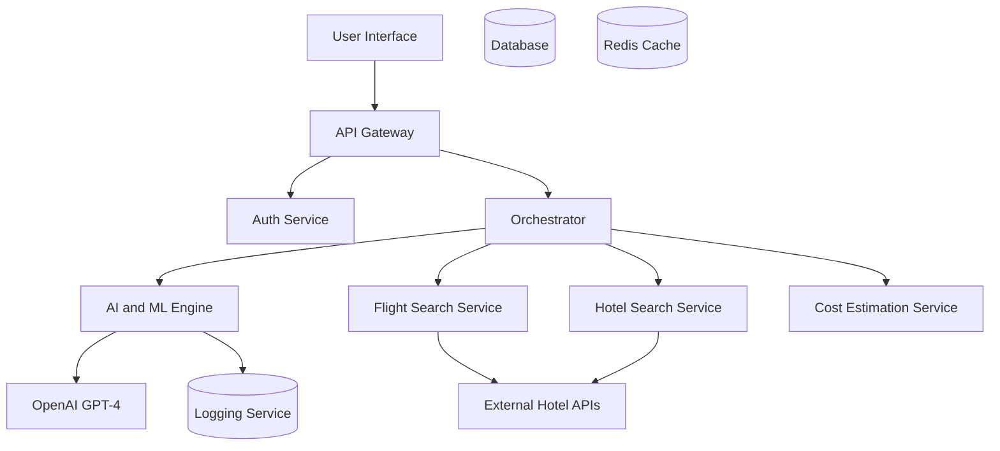
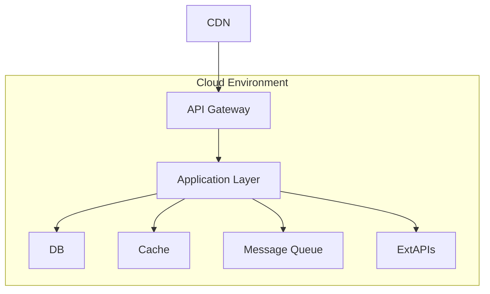

## 1. Document Overview
- **Project Name:** AI Travel Planning Assistant
- **Version:** 1.0
- **Date:** October 26, 2023
- **Prepared by:** Senior Technical and Solution Architect

This document provides a comprehensive architecture for the AI Travel Planning Assistant project. The solution aims to offer an intelligent platform facilitating end-to-end trip planning utilizing AI capabilities.

## 2. System Context
The system assists users in planning travel by understanding their goals and providing flight, hotel searches, itineraries, and cost estimates. It interfaces with third-party APIs for updated travel data and offers a user interface for interaction.

## 3. Solution Overview
- Leverages AI for understanding user goals.
- Integrates with external APIs for real-time flight and hotel data.
- Provides an intuitive user interface for plan creation and refinement.
- Utilizes robust infrastructure to support high concurrency and data security.

## 4. Application Architecture

## 5. AI / ML Framework and Stack
- **LLM Provider:** OpenAI
- **Model:** GPT-4
- **Orchestration Framework:** LangChain
- **Embedding Model & Vector Store:** Pinecone for embeddings and vector storage.
- **Tool Calling Approach:** LangChain tools with a robust tool registry.
- **Safety & Governance:** Prompt logging, moderation filters, cost controls per-user, latency and timeout configurations.

## 6. Technology Architecture
- **Core Technologies:** Python 3.10, FastAPI for backend, React for frontend
- **Main Libraries:** LangChain for orchestration, OpenAI API SDK
- **Database:** PostgreSQL 15 for structured data, Redis 7 for caching

## 7. Data Architecture
- **Core Entities:** User, TravelGoal, FlightOption, HotelOption, Itinerary
- **Key Fields:**
  - User: ID, Name, Email, Preferences
  - TravelGoal: ID, Destination, Dates, Budget
  - FlightOption: ID, Airline, Price, Times
  - HotelOption: ID, Name, Price, Location
  - Itinerary: ID, UserID, Activities, TotalCost
- **Relationships:** A User has many TravelGoals; an Itinerary belongs to a TravelGoal.

## 8. API and Integration Architecture
| Domain         | Endpoint                    | Method | Auth | Request (summary)                          | Response (summary)                       | Error shape           |
|----------------|-----------------------------|--------|------|-------------------------------------------|-----------------------------------------|-----------------------|
| User           | /api/v1/users               | POST   | No   | Create user with name, email              | User details                            | 400, 409, 500         |
| Travel Goals   | /api/v1/travel-goals        | POST   | Yes  | Create travel goals with destination, date| Travel goal created                      | 401, 403, 422, 500    |
| Flights Search | /api/v1/flights/search      | GET    | Yes  | Search with criteria: destination, dates  | List of flight options                   | 400, 401, 500         |
| Hotels Search  | /api/v1/hotels/search       | GET    | Yes  | Search with location, price range         | List of hotel options                    | 400, 401, 500         |
| Itinerary      | /api/v1/itineraries         | GET    | Yes  | List user itineraries                     | Itinerary details                        | 404, 401, 500         |
| Cost Estimate  | /api/v1/estimate-cost       | GET    | Yes  | Estimate cost for itinerary ID            | Cost breakdown                           | 400, 401, 500         |

## 9. Security Architecture
| Threat                    | Impact                    | Mitigation                                                                 | Owner / control                  |
|---------------------------|---------------------------|--------------------------------------------------------------------------|----------------------------------|
| Broken authn             | Unauthorized access       | OAuth2/OIDC, short-lived tokens, MFA                                     | Security Team                    |
| Broken authz             | Data leakage              | Role-based access controls, audits                                       | Security Architect               |
| Injection                | Data corruption           | Use ORM for DB interactions, input validation                            | Development Team                 |
| XSS/CSRF                 | Session hijacking         | CSP, HttpOnly cookies, CSRF tokens                                       | Frontend Team                    |
| Secrets exposure         | Credential compromise     | Secrets management via environment variables, vault                       | DevOps Team                      |
| API abuse                | Resource exhaustion       | Rate limiting, IP blocking                                               | Infrastructure Team              |
| Data leakage             | Privacy breach            | PII redaction in logs, data encryption                                   | Security Architect               |
| AI-specific              | Model manipulation        | Prompt validation, moderation layers                                     | AI Engineering Team              |

## 10. Infrastructure Architecture

| Component         | Timeout | Retries | Circuit breaker | Bulkhead/queue | Notes                              |
|-------------------|---------:|--------:|-----------------|----------------|-------------------------------------|
| Internal API      | 2s      | 2       | Enabled         | N/A           | For all internal service calls      |
| External API      | 8s      | 2 (GET) | Enabled         | N/A           | Circuit breaker on server errors    |
| LLM calls         | 60s     | 1       | Enabled         | N/A           | Backoff strategy enabled            |

## 11. Observability Architecture
| SLI                       | Target SLO  | Window | Alert threshold | Notes                              |
|---------------------------|-------------|--------|-----------------|-------------------------------------|
| API Response Time         | <3s         | 99%    | >5s at P95      | Monitored via metrics dashboards    |
| Flight Search Availability| 99.9%       | Daily  | <99.7% daily    | Alerts on external API failures     |
| Error Rate                | <0.1%       | Hourly | >0.5% at any time| Monitored via logging              |
| AI Response Success       | >99%        | Weekly | <98% on any day | AI response monitoring              |
| Cache Hit Ratio           | >85%        | Hourly | <70% any hour   | Cache effectiveness tracking        |
| DB Query Performance      | <2s         | Daily  | >3s for 5%+ queries | SQL tracing setup             |

## 12. Quality Attributes and Architecture Decisions
| ADR                        | Decision                               | Alternatives                         | Rationale                        | Consequences                   |
|----------------------------|----------------------------------------|--------------------------------------|----------------------------------|--------------------------------|
| Use of GPT-4              | GPT-4 for AI tasks                     | Other LLMs                           | Best performance for NLP         | High cost, requires monitoring |
| Orchestration framework   | LangChain for tool orchestration       | Direct SDK                           | Advanced tool management         | Learning curve for engineers   |
| Database Choice           | PostgreSQL 15 for primary data store   | NoSQL options                        | Strong relational needs          | RDBMS cost and maintenance     |
| API Framework             | FastAPI for backend APIs               | Flask/Django                         | Strong async support, flexibility| Newer framework, potential risks|
| Authentication Approach   | OAuth2/OIDC for secure auth            | Custom JWT                           | Industry standard, secure        | Additional setup complexity    |
| Deployment Strategy       | Rolling updates across services        | Blue/Green, Canary                   | Minimal downtime                 | Requires compatibility checks  |

## 13. Development Guidance for Engineering Teams
- Use defined models and endpoints, adhere to RESTful API practices.
- Prioritize security measures, follow input validation and PII redaction protocols.
- Ensure observability integration for prompt troubleshooting and monitoring.
- Adopt recommended resilience settings, follow circuit breaker configurations.
- Interface frequently with AI team for any model or performance changes.

## 14. Suggested Delivery Breakdown for PM and Teams
- **Phase 1:** Setup Infrastructure, Authentication System
- **Phase 2:** Develop Core API Services (Flight, Hotel, Itinerary)
- **Phase 3:** Integrate AI Engine and Orchestration Framework
- **Phase 4:** Implement User Interface Integration
- **Phase 5:** Conduct Security Review and Load Testing

## 15. Open Risks and Architecture Concerns
- Cost and latency associated with AI models.
- Complexity of orchestration and tool integration.
- Dependency on third-party APIs for travel data accuracy.
- Potential scaling challenges in peak travel seasons.

## 16. Appendices
- **Appendix A:** Glossaries of Terms
- **Appendix B:** Acronyms and Abbreviations
- **Appendix C:** External Integrations and Reference APIs

This architecture document presents an implementable framework for building an AI-powered travel planning assistant. It follows structured, technical guidelines ensuring all essential aspects are covered in the design, promoting a robust, scalable, and secure system.